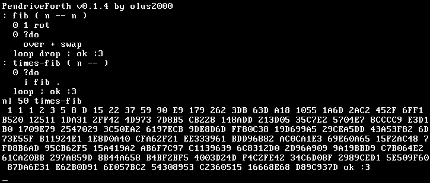

================================================================================
                                  PendriveForth
================================================================================

A bootable 32-bit Forth system for x86 with(out, yet) a visual block editor. It
works in VGA mode 3 with its default codepage 437 charset and 80x25 character
display.

**DISCLAIMER:** This is just a personal beginner project. I make no guarantees
about stability or safety of the system. I advise running it in an emulator.
Boot it at your own risk.

How to
======

Emulator
--------

The recommended way of running PendriveForth is with qemu_ executable
``qemu-system-i386``. If you have that and nasm_ you can run the project
directly by executing ``make run`` in the repository folder. If you don't, or
wish to run it differently I hope you know what you're doing because I sure
don't.

.. _qemu: https://www.qemu.org/
.. _nasm: https://www.nasm.us/

Bootable drive
--------------

The """intended""" way to run PendriveForth is by burning it on a USB stick and
booting directly. My legal team advises me not to recommend this, as I am not
experienced in osdev or assembly and my code may break something on the machine
you boot it from. If you want to try anyway it you should first identify the
disk you want to burn the image into with ``lsblk`` or similar tool. Then go
into the repository folder and run::

  make
  cat pdf.img > /dev/your_disk

That should be enough! Now plug the disk into some computer with an x86
processor and try booting from it.

Non-Linux systems
-----------------

If you're running Windows or Mac I can't help you, but I'm sure there are tools
for your system for compilation, emulation and burning drives.

What's inside
=============

The source code of this project is entirely contained within the file
`pendriveforth.asm`_. It can be split into several parts:

.. _pendriveforth.asm: ./pendriveforth.asm

Bootloader
----------
First block of the compiled image is loaded into address 0x7c00 and is
responsible for loading the rest of the code and switching to protected mode. It
initialises the global descriptor table and interrupt descriptor table, sets up
the stacks and executes the initialisation script.

After it jumps to the initialisation script execution is never intended to
return to the bootloader and it can be safely overwritten.

Descriptor tables
-----------------

The loaded payload starts at 0x500 with the global descriptor table and the
interrupt descriptor table.

GDT only has the minimal three entries: the null descriptor, the data descriptor
and the code descriptor, the latter two encompassing the entire 32b-addressible
memory.

IDT has 48 entries, 32 hardware exception handlers and 16 interrupt request
handlers. Most of them don't actually do anything: exception handlers print an
error message and perform ``abort``, and interrupt requests halt the machine.
The only unmasked interrupt and the only functioning interrupt is interrupt 1:
keyboard. It is responsible for receiving keyboard events, updating ``pressed``
and ``keys`` tables and caching the latest keyboard event in ``last-ekey``.

Assembly helpers
----------------

Next follow some pure-assembly subroutines. They are responsible for interfacing
with the screen: printing characters and numbers, moving the cursor and
scrolling the screen. At some point in the development they will all probably
be incorporated into assembly words.

Assembly words
--------------

Here actual Forth begins. This section contains the starting section of the
Forth dictionary: definitions of words which bodies are implemented in assembly.
Each word defines two labels: ``entry_<name>`` where its dictionary entry
starts, and ``body_<name>`` where code of its definition starts. As the project
progresses I will try to keep this section to the minimum implementing as many
words as possible in pure Forth, with a few exceptions for performance. If a
word is defined here then it is in one of the following categories:

1. Is required for the print-eval loop

2. Requires access to assembly

3. Would be very ugly or much slower when written in Forth

For now this section also includes the ``test`` label but it here just for the
sake of debugging and will be removed for v1.0

Forth words
-----------

The initialisation script that defines high-level Forth words, including ``:``
and the repl. It consists of a single, long string which is interpreted by the
parse-eval loop after boot.

Glossary
========

At some point there will be definitions of every word here. Most of them are
compatible with the `Forth-2012`_ standard, but some are slightly renamed or
have slightly different definitions.

.. TODO
.. _Forth-2012: https://forth-standard.org

Gallery
=======

   Fibonacci sequence (emulated in qemu)

   Binary exponentiation (booted from pendrive)

